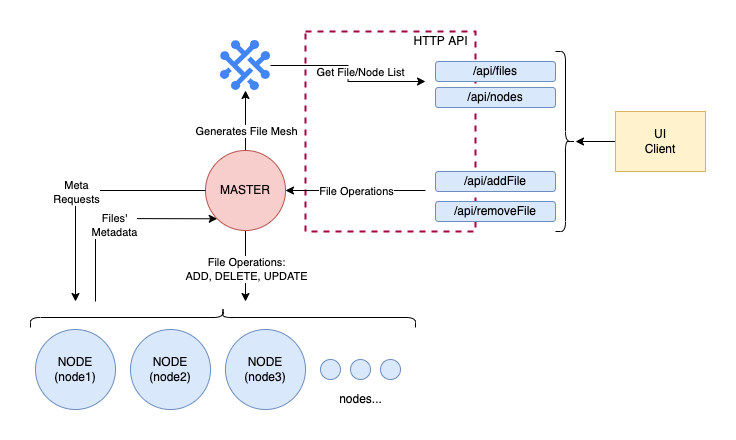
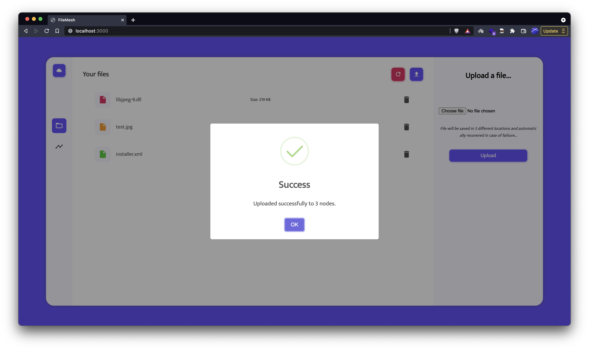
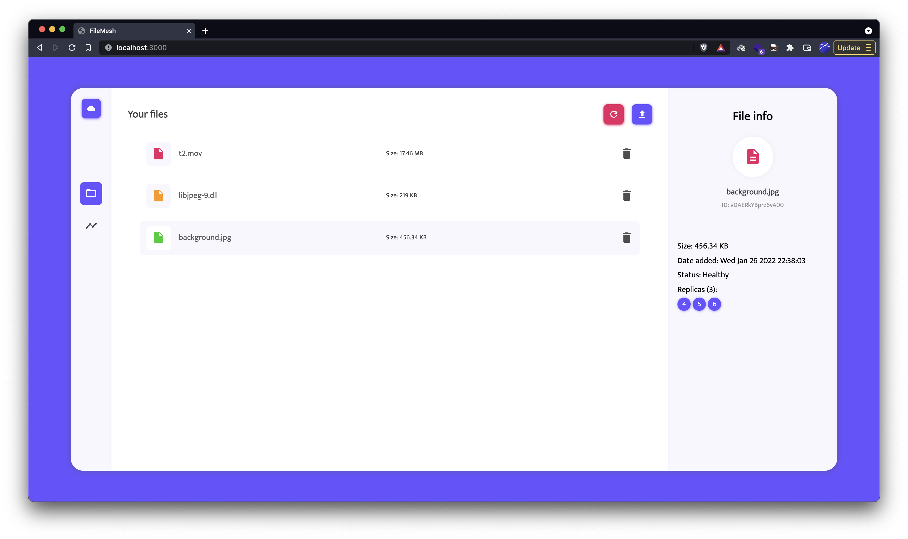
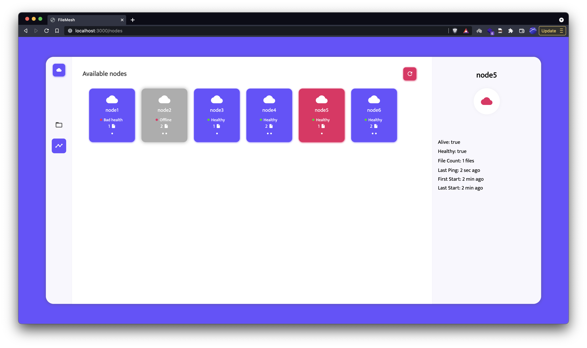
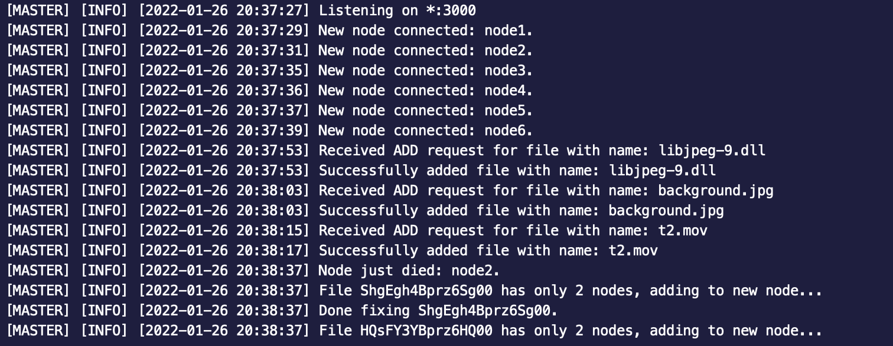

This is a remake of [file-mesh](https://github.com/artur99/file-mesh) but with TS instead of JS. The original project was a university project and was written in JS. I decided to rewrite it in TS because while building the initial version I actually realised for the first time how useful TS is in life. :> Now I can't live without it. ✨😌

BTW, this is bun compatible, and it works great great great. ⚡️

# Distributed File Storage
University project implementing a basic prototype for a distributed file storage with multiple replica storage, with redistribution on failovers. Any node node can die and the system will still work. Master node stores no data persistently and generates the file mesh from the nodes' data.

## Installation
Project is written in js, so `bun` is the only requirement. Installing dependencies:
```bash
bun install
```

## Running
Starting the master:
```bash
$ bun runner MASTER
```

Starting nodes:
```bash
$ bun runner NODE node1 &
$ bun runner NODE node2 &
$ bun runner NODE node3
$ # .. and more
```

## Architecture
The master starts a HTTP server for the clients to manage files and a socket-io server for the nodes to connect to it and store files.

Each node connects to the master at startup, identifying themselves with their configured name. Node checks for a memory file at startup and uses it to resume their state if there's any. Then it starts sending a ping/heartbeat to the master every a few seconds.

The master iterates trough the connected nodes (keeping track of their connection states and pings), and periodically sends a request for meta (nodes responding with metadata for their file list). The master then generates the entire file mesh and makes it available in a HTTP API readable by the web client.




## Screenshots

<a href="./docs/ss1.png"></a>

Alert after adding a file.


<a href="./docs/ss2.png"></a>

File list and metadata for file `background.jpg` (stored on nodes: 4, 5 and 6).


<a href="./docs/ss3.png"></a>

Node statuses page.


<a href="./docs/ss4.png"></a>

Logs from the master after node2 was killed.
